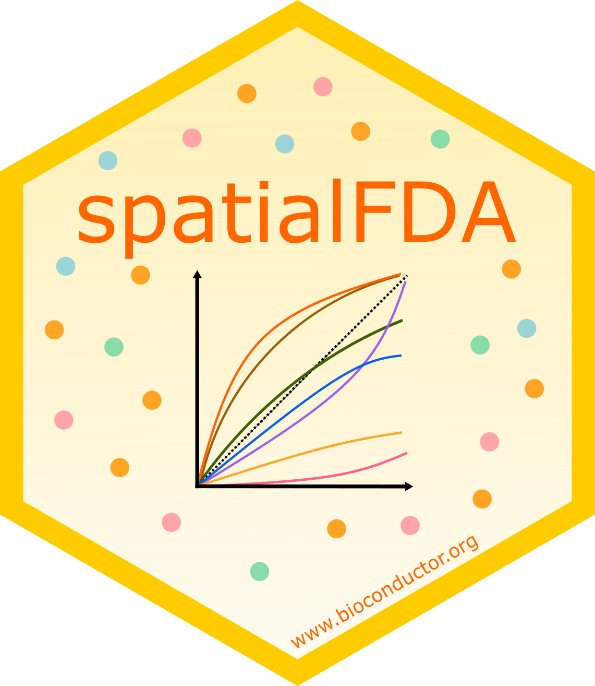

<!-- README.md is generated from README.Rmd. Please edit that file -->

# spatialFDA

[](https://github.com/mjemons/spatialFDA/actions/workflows/R-CMD-check.yaml)



spatialFDA is a tool to calculate spatial statistics functions on a
`SpatialExperiment` object using the `spatstat` library. It contains
functions to plot these spatial statistics functions. In addition, users
can compare the statial statistics functions using functional data
analysis. Here, we use the `refund` library.

## Installation

You can install the official released `Bioconductor` version of
`spatialFDA` via

``` r
if (!require("BiocManager", quietly = TRUE))
    install.packages("BiocManager")
BiocManager::install("spatialFDA")
```

You can install the development version of `spatialFDA` from
[GitHub](https://github.com/) with:

``` r
# install.packages("devtools")
devtools::install_github("mjemons/spatialFDA")
```

## Disclaimer

This package is still under active development, the content is therefore
subject to change. Please refer to the `Bioconductor` releases for
stable versions.

## Contact

In case you have suggestions to `spatialFDA` please consider opening an
issue to this repository.
